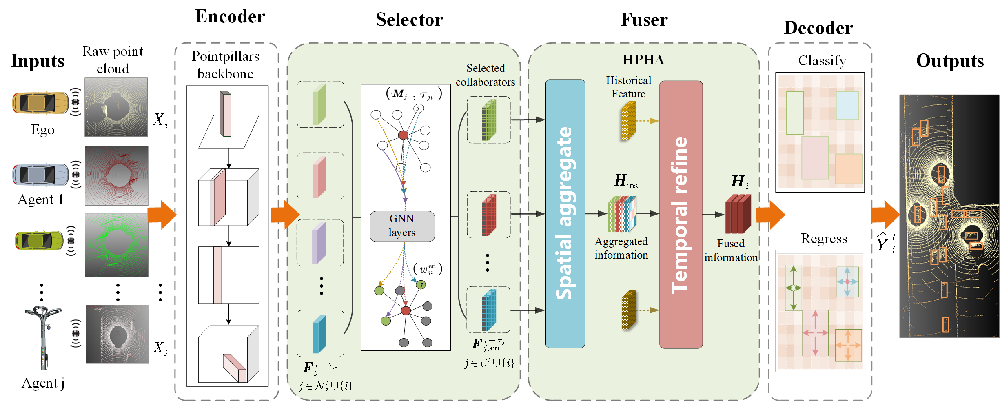

## Select2Col: Leveraging Spatial-Temporal Importance of Semantic Information for Efficient Collaborative Perception
This is the official implementation of paper "Select2Col: Leveraging Spatial-Temporal Importance of Semantic Information for Efficient Collaborative Perception".

 Zhejiang University, Zhejiang Lab

## Main idea
**Abstract:**  Collaboration by leveraging the shared semantic information plays a crucial role in overcoming the perception capability limitations of isolated agents. However, existing collaborative perception methods tend to focus solely on the spatial features of semantic information, while neglecting the importance of the temporal dimension. Consequently, the potential benefits of collaboration remain underutilized. In this article, we propose Select2Col, a novel collaborative perception framework that takes into account the spatial-temporal importance of semantic information. Within the Select2Col, we develop a collaborator selection method that utilizes a lightweight graph neural network (GNN) to estimate the importance of semantic information (IoSI) in enhancing perception performance, thereby identifying advantageous collaborators while excluding those that bring negative impact. Moreover, we present a semantic information fusion algorithm called HPHA (historical prior hybrid attention), which integrates multi-scale attention and short-term attention modules to capture the IoSI in feature representation from the spatial and temporal dimensions respectively, and assigns IoSI-consistent weights for efficient information fusion. Extensive experiments on two open datasets demonstrate that our proposed Select2Col significantly improves the perception performance compared to state-of-the-art approaches. The code associated with this research is publicly available at https://github.com/huangqzj/Select2Col.



## Features

- Dataset Support
  - [x] V2XSet
  - [x] OPV2V

- SOTA collaborative perception method we compared
    - [x] [V2X-ViT [ECCV2022]](https://arxiv.org/abs/2203.10638)
    - [x] [Where2comm [Neurips2022]](https://arxiv.org/abs/2209.12836)
    - [x] [V2VNet [ECCV2020]](https://arxiv.org/abs/2008.07519)

- Visualization
  - [x] 3D visualization

## Citation

If you find this code useful in your research then please cite

```
@inproceedings{Select2Col,
  author    = {Yuntao Liu, Qian Huang, Rongpeng Li, Xianfu Chen, Zhifeng Zhao, Shuyuan Zhao, Yongdong Zhu and Honggang Zhang},
  title     = {Select2Col: Leveraging Spatial-Temporal Importance of Semantic Information for Efficient Collaborative Perception},
  month     = {September},  
  year      = {2023}
}
```

## Quick Start
### Install
```bash
# Clone repo
git clone https://github.com/huangqzj/Select2Col

cd Select2Col

# Setup conda environment
conda create -y --name Select2Col python=3.8

conda activate Select2Col
# Please install pytorch >= 1.8.1, newest version can work well
conda install -y pytorch==1.9.1 torchvision cudatoolkit=11.1 -c pytorch
# spconv 2.0 install, choose the correct cuda version of yourself
pip install spconv-cu111

# Install dependencies
pip install -r requirements.txt
# Install bbx nms calculation cuda version
python opencood/utils/setup.py build_ext --inplace
python opencood/pcdet_utils/setup.py build_ext --inplace

# install Select2Col into the environment
python setup.py develop
```

### Download dataset V2XSet
The data can be found from [google drive](https://drive.google.com/drive/folders/1r5sPiBEvo8Xby-nMaWUTnJIPK6WhY1B6?usp=sharing).  Since the data for train/validate/test
is very large, the data set was splited into small chunks, which can be found in the directory ending with `_chunks`, such as `train_chunks`. After downloading, please run the following command to each set to merge those chunks together:

```
cat train.zip.part* > train.zip
unzip train.zip
```
Of course, you can also directly download the whole zip file, e.g. train.zip

### Download dataset OPV2V
All the data can be downloaded from [google drive](https://drive.google.com/drive/folders/1dkDeHlwOVbmgXcDazZvO6TFEZ6V_7WUu). Same to V2XSet dataset, the data for train/validate/test
is also very large, the data set was also splited into small chunks, which can be found in the directory ending with `_chunks`, such as `train_chunks`. After downloading, please run the following command to each set to merge those chunks together:

```python
cat train.zip.part* > train.zip
unzip train.zip
```
Of course, you can also directly download the whole zip file, e.g. train.zip

### Structure
After downloading is finished, please make the file structured as following:

```sh
Select2Col # root of Select2Col
├── v2xset # the downloaded v2xset data
│   ├── train
│   ├── validate
│   ├── test
├── OPV2V # the downloaded v2xset data
│   ├── train
│   ├── validate
│   ├── test
├── Select2Col # the core codebase

```


### Train your model
Our code is developed based on [OpenCOOD](https://github.com/DerrickXuNu/OpenCOOD) which uses yaml file to configure all the parameters for training. To train your own model from scratch or a continued checkpoint, run the following commonds:
```python
python opencood/tools/train.py --hypes_yaml ${CONFIG_FILE} [--model_dir  ${CHECKPOINT_FOLDER}]
```
Arguments Explanation:
- `hypes_yaml`: the path of the training configuration file, e.g. `opencood/hypes_yaml/point_pillar_Select2Col.yaml`, meaning you want to train
an intermediate fusion model which utilizes point_pillar as the backbone. See [Tutorial 1: Config System](https://opencood.readthedocs.io/en/latest/md_files/config_tutorial.html) to learn more about the rules of the yaml files.
- `model_dir` (optional) : the path of the checkpoints. This is used to only when you want to fine-tune the trained models or continue training. If train your own model from scratch,this arguments is not necessary. 

### Test the model
Before you run the following command, first make sure the `validation_dir` in config.yaml under your checkpoint folder
refers to the testing dataset path, e.g. `V2XSet/validate` or `opv2v_data_dumping/test`. 

```python
python opencood/tools/inference.py --model_dir ${CHECKPOINT_FOLDER} --fusion_method ${FUSION_STRATEGY} --save_vis_n ${amount}
```
Arguments Explanation:
- `model_dir`: the path to your saved model.
- `fusion_method`: indicate the fusion strategy, currently support 'early', 'late', 'intermediate', 'no'(indicate no fusion, single agent).
- `save_vis_n`: the amount of saving visualization result, default 10

The evaluation results  will be saved in the model directory.

## Acknowledgements
Thank for the excellent cooperative perception codebases [OpenCOOD](https://github.com/DerrickXuNu/OpenCOOD).

Thank for the excellent cooperative perception datasets V2XSet,[OPV2V](https://mobility-lab.seas.ucla.edu/opv2v/) .

## Relevant Projects

Thanks for the insightful previous works in cooperative perception field.

**V2vnet: Vehicle-to-vehicle communication for joint perception and prediction** 
*ECCV20* [[Paper]](https://arxiv.org/abs/2008.07519) 

**OPV2V: An Open Benchmark Dataset and Fusion Pipeline for Perception with Vehicle-to-Vehicle Communication** 
*ICRA2022* [[Paper]](https://arxiv.org/abs/2109.07644) [[Website]](https://mobility-lab.seas.ucla.edu/opv2v/) [[Code]](https://github.com/DerrickXuNu/OpenCOOD)

**V2X-ViT: Vehicle-to-Everything Cooperative Perception with Vision Transformer** *ECCV2022* [[Paper]](https://arxiv.org/abs/2203.10638) [[Code]](https://github.com/DerrickXuNu/v2x-vit) [[Talk]](https://course.zhidx.com/c/MmQ1YWUyMzM1M2I3YzVlZjE1NzM=)

**Where2comm: Where2comm: Communication-Efficient Collaborative Perception via Spatial Confidence Maps** *Neurips 2022* [[Paper]](https://arxiv.org/abs/2209.12836) [[Code]](https://github.com/MediaBrain-SJTU/Where2comm) 


## Contact

If you have any problem with this code, please feel free to contact **huangq@zhejianglab.com**.

